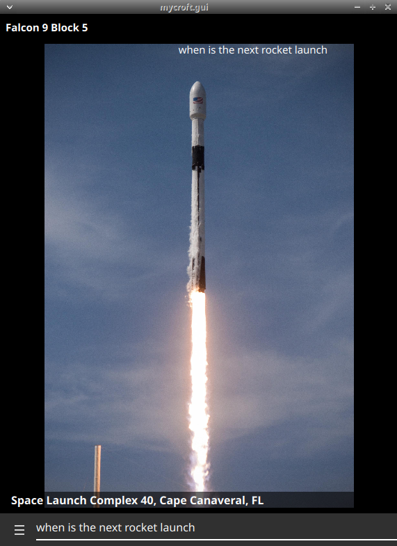

#  Rocket Launches

## About

This skill interacts with https://launchlibrary.net/ api to return the latest space launch.

## Examples
* "when is the next rocket launch"
* "tell me more"

## TODO
* next/previous intent

## Credits
- JarbasAi
- [msev](https://github.com/marksev1/Mycroft-SpaceLaunch-Skill)
- [praxeo](https://github.com/praxeo/mycroft_spaceflightnow_skill)

## Category
**Information**

## Tags
#space #information #gui
